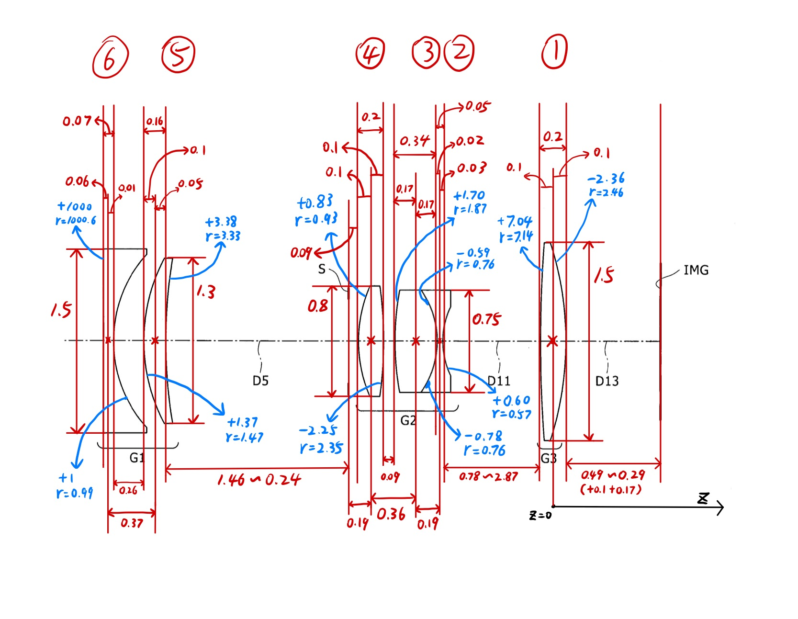

# CS184 Final Project
# Realistic Lens Simulation

Authors: Alex Hao, Arthur Yin, Cindy Chen, Hanchen Wang

## Notes on this version:

 The lens configuration is still buggy, but good enough to implement auto focus. Do not try to zoom the lens in the GUI as the program
will crash (lol), just use the already-set aperture and zoom settings. There should be a good amount of depth of field to for auto focus to work. I will keep working on the lens while you guys are writing auto focus, and will merge back once I'm ready. -Alex 

## Part 1: Multi-Element Zoom Lens

### Reference design:

 We simulated a Sony-deisgned zoom lens with a zoom ratio of 2.8x and an aperture range of f2.8 to f5.6. The design is from US Patent No. US 7612949 B2, filed in Nov 3rd, 2009. Below is a diagram of the lens elements configuration with dimensions annotated.

    
### New data structures:

 1. Added a Lens struct in camera.h, which contains all the parameters associated with a single lens element. 

 2. Added \*lens_elem_one to \*lens_elem_six fields to the camera class to keep track of all lens elements of the camera 

 3. Added aperture_pos and aperture_radius fields to the camera class to store the position and radius of the lens' aperture. 

 4. Added \zoom_index field to the camerea class, which ranges between 0 and 1, with 0 being the wide angle end and 1 being the telephoto end. 

 5. Added focus_offset field to the camera class as the API for the auto-focus algorithm. This values offsets the distance between the sensor and the back of the lens, so adjusting it should control the focus. 

### New GUI functionalities:

 1. "W" and "T" key presses can now zoom the lens wider or tighter, respectively. There are five levels of adjustments. 

## Part 2: Contrast-Detection Auto Focus

### Some ideas:

 1. The auto focus algorithm talks to the lens exclusively via the \Camera::focus_offset attribute, so the output of the algorithm should only be an adjustment of that attribute. This attribute can be positive or negative, but a large absolute value may break the lens configuration, so be cautious. 

 2. May want to run the auto focus algo before the actual rendering begins. Once the algo calculates the final value for focus_offset, the full rendering can start using that value. 

 3. Probably want to set a "focus patch" in the screen center, about tens of pixels by tens of pixels. The algorithm simply renders that patch (not the full image) with many different focus_offset values, and it terminates once it finds a value that makes the patch look sharp (that is, decreasing or increasing focus_offset only makes the patch more blurry). 

 4. A challenge is to define sharpness, i.e. how can you quantify the sharpness or blurriness of a image patch. 

 5. This algo may not always succeed in finding the correct focus, and that is ok, since its success depends on where the center patch points to. If it points to an area with distinct lines, the focusing will be easier; if it points to, for instance, a pure white wall, it can't possibly focus correctly. So we probably want to let the center patch point to a good spot during testing and debugging. 

    
